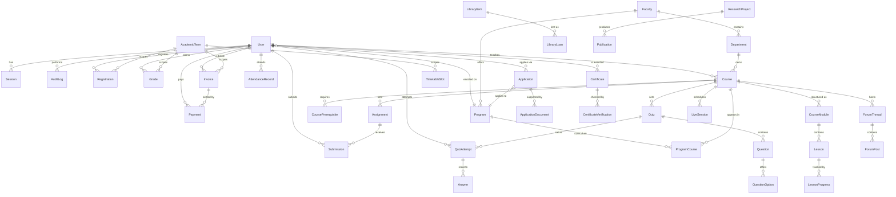

# Data model

The authoritative definition is [`prisma/schema.prisma`](../prisma/schema.prisma). This
document explains the shape and the decisions behind it.

## Entity relationship diagram



## The tables, grouped by what they are for

### Identity and access

| Table | Purpose |
| --- | --- |
| `User` | One row per person, whatever their role. An applicant who is admitted becomes a student by role change, not by getting a second row — so their application history, their first invoice and their eventual degree all hang off one identity. |
| `Session` | A row per sign-in. The JWT is stateless, but this row is what makes "sign out everywhere", forced revocation on role change, and suspension effective before token expiry. |
| `AuditLog` | Append-only. No code path updates or deletes a row. |

### Academic structure

`Faculty → Department → Course`, with `Program` sitting across the top. Programmes and
courses are many-to-many through **`ProgramCourse`**, which carries the curriculum metadata
— which year and semester a course sits in, and whether it is core or elective *for that
programme*. The same course is core in one degree and an elective in another, so this
cannot live on `Course`.

`CoursePrerequisite` is a self-relation on `Course`. Registration re-checks it server-side;
see `prerequisitesMet()` in `src/lib/grading.ts`.

### Assessment

`Assignment → Submission` and `Quiz → Question → QuestionOption`, with
`QuizAttempt → Answer` recording a sitting.

Two fields on `QuizAttempt` are worth understanding:

- **`servedOrder`** — the question ids for this attempt, persisted at the moment it starts.
  Shuffling per render would let a candidate reload to reshuffle, and would make a
  proctoring report impossible to reconstruct afterwards.
- **`proctorFlags`** — tab-blur, window-blur and copy events captured during the attempt.

`Grade` is the *published* course result, distinct from the marks on individual
submissions. A mark exists as soon as a lecturer releases it; a grade exists once the
course result is approved and published, and that is what a transcript renders.

### Admissions

`Application` deliberately duplicates name, email and country rather than relying solely on
a `User`. Applications can be submitted anonymously, and an applicant's later profile edits
must not silently rewrite what they told us at the time of the decision.

Enrolment is a single transaction in
[`/api/applications/[id]/decision`](../src/app/api/applications/[id]/decision/route.ts):
promote the account to `STUDENT`, issue a student number, attach the programme, and raise
the first invoice. Splitting these risks a student who exists but cannot register, or one
who is registered but never billed.

### Finance

`Invoice` carries both `amount` and `amountPaid` so a partial payment is a first-class
state rather than something derived by summing payments. `Payment` records each attempt
including failures, because a failed payment is exactly what a student calls the finance
office about.

Money is `Decimal(12,2)`, never a float.

### Credentials

`Certificate.documentHash` is a SHA-256 of the canonical payload (serial, name, student
number, programme, type, classification, issue date — fixed key order, dates to the day).
Verification recomputes it from the live record rather than comparing stored strings, so a
tampered row fails rather than returning a forged "valid". See `src/lib/certificates.ts`
and its tests.

`CertificateVerification` logs each external check, which lets graduates see their
credential being used and lets us spot scraping.

## Conventions

- Every table has `createdAt`, and every mutable table has `updatedAt`.
- User-facing identifiers (`studentNumber`, `invoiceNumber`, `serial`, `reference`) are
  separate from primary keys, so they can be reissued without breaking foreign keys.
- Cascades apply only where the child is meaningless without its parent. Academic records —
  grades, payments, certificates — are never cascade-deleted; deleting a user leaves those
  rows with a null reference rather than destroying the institutional record.
- Indexes exist on every foreign key used for filtering and on the composite keys the
  portals query by (`[userId, status]`, `[courseId, termId]`, `[audience, publishedAt]`).

## Migrations

Development uses `prisma db push`. For any deployment, generate a migration:

```bash
npx prisma migrate dev --name descriptive_change
npx prisma migrate deploy      # in CI/CD, before the new pods take traffic
```

The Kubernetes `rumax-migrate` Job runs `migrate deploy` as a release step.
